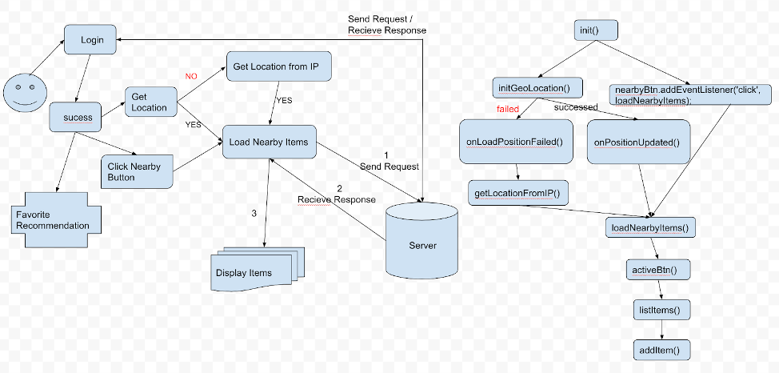
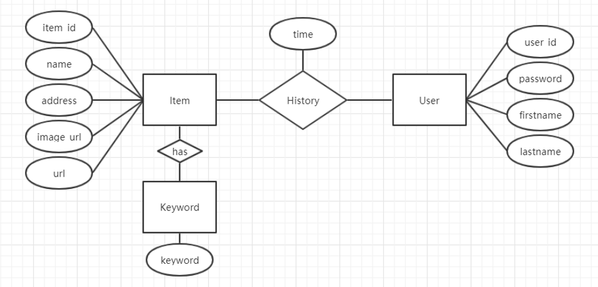
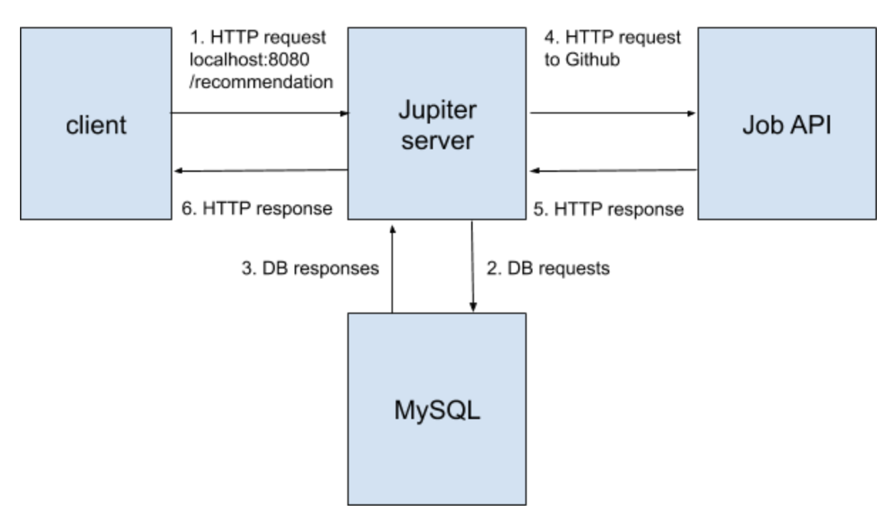

# Project Jupiter
## Overview: AWS Based Web Service Development - Job Recommendation
This project aims to use search history and personalization to improve job search and recommendation.
* Created Java servlets with RESTful APIs to handle HTTP requests and responses.
* Built MySQL database on Amazon RDS to store position data from Github API.
* Designed algorithms (e.g. content-based recommendation) to improve job recommendation based on favorite records.
* Performed front-end web UI design and implementation using HTML/CSS/JavaScript.
* Deployed server to Amazon EC2 to handle 150 queries per second tested by Apache JMeter.
 
 
 

### Web Application Setup
* Setup Eclipse development environment for a maven project.
* Created and started a local tomcat server.
* Created a web project and added it to the tomcat server.

### Servlets with RESTful APIs
* Created SearchItem, RecommendItem servlets.
* Added RpcHelper utility class to handle all rpc parsing codes.
* Implemented ItemHistory servlet to sere history realted request.

### Frontend Implementation
* Created index.html for the basic layouts.
* Created main.css for the web page styles.
* Implemented main.js with Ajax technique.

### GitHub Job API
* Connected GitHub Job API with SearchItem servlet.
* Purified jobs data returned from GitHub Job API.

### Keyword Extraction by TF-IDF
* Utilized Monkey Learn API to extract keywords from job descriptions.

### MySQL on Amazon RDS
* Setup MySQL on Amazon RDS.
* Saved/read data to/from MySQL by JDBC

### Tables for Jupiter Project
 

### Authentication
* Implemented session based authentication process.
* Created login, logout and register servlets to serve user requests.

### Recommendation Engineering Design
